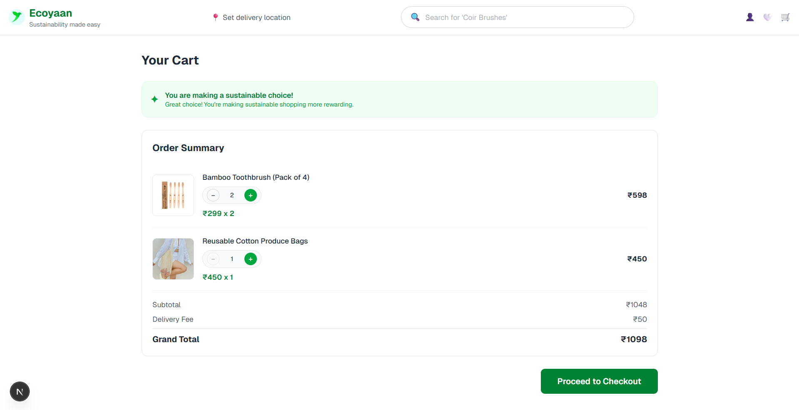
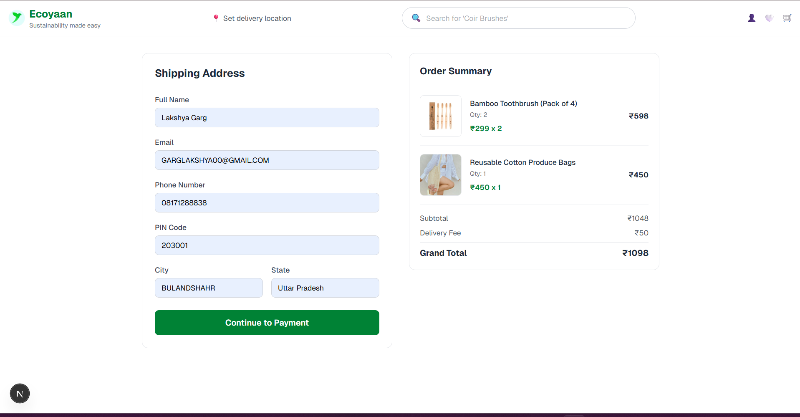
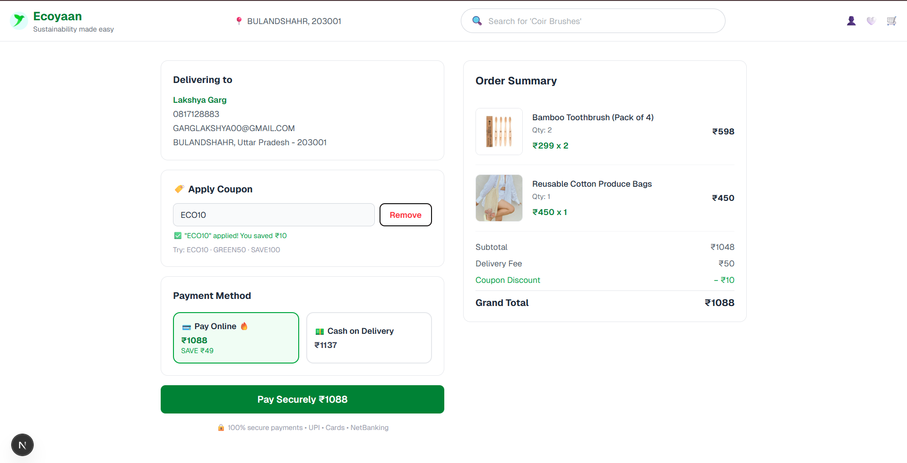
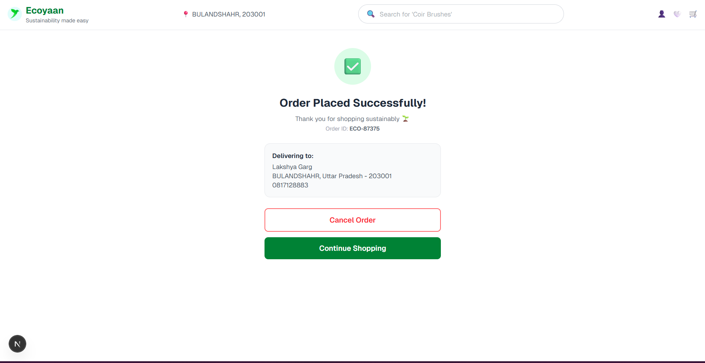

# 🌱 Ecoyaan Checkout Flow

A simplified, full-stack checkout experience built with **Next.js App Router**, **Tailwind CSS**, and **React Context API** — inspired by the real [Ecoyaan](https://ecoyaan.com) platform.

**Live Demo:** [your-vercel-url-here]  
**Repository:** [your-github-url-here]

---

## 📸 Screenshots

### Cart


### Shipping Address


### Payment


### Order Success


---

## ✨ Features

- **Server-Side Rendering** — cart data is fetched on the server before the page is sent to the browser, ensuring zero layout shift and fast first paint
- **3-step checkout flow** — Cart → Shipping Address → Payment → Order Success
- **Live quantity controls** — add or remove items directly from the cart
- **Form validation** — real-time error messages for all shipping fields (email regex, 10-digit phone, 6-digit PIN)
- **Coupon system** — apply/remove discount codes with instant feedback
- **Payment method toggle** — Pay Online vs Cash on Delivery with dynamic pricing
- **Order cancellation** — cancel within the success screen (a feature missing from the real Ecoyaan site — see notes below)
- **Responsive design** — single column on mobile, two-column layout on desktop
- **Dynamic navbar** — delivery location updates automatically once address is entered

---

## 🛠️ Tech Stack

| Layer | Choice | Reason |
|-------|--------|--------|
| Framework | Next.js 14 (App Router) | Native SSR via Server Components |
| Language | TypeScript | Type safety across components and context |
| Styling | Tailwind CSS | Rapid, responsive UI without custom CSS overhead |
| State | React Context API | Lightweight — appropriate for a linear 3-step flow |
| Mock Backend | Next.js API Routes | No external server needed; keeps everything in one repo |

---

## 🏗️ Project Structure

```
ecoyaan-checkout/
├── app/
│   ├── api/cart/
│   │   └── route.ts           # Mock API — returns cart JSON
│   ├── shipping/
│   │   └── page.tsx           # Step 2: Shipping address form
│   ├── payment/
│   │   └── page.tsx           # Step 3: Payment + coupon
│   ├── order-success/
│   │   └── page.tsx           # Success + cancel order
│   ├── layout.tsx             # Root layout with Navbar + Context Provider
│   ├── page.tsx               # Step 1: Cart (SSR Server Component)
│   └── globals.css
├── components/
│   ├── Navbar.tsx             # Sticky nav with dynamic delivery location
│   ├── CartItem.tsx           # Reusable item card with optional +/- controls
│   ├── OrderSummary.tsx       # Reusable summary panel used across all screens
│   └── CheckoutInitializer.tsx # Bridges SSR data into client-side Context
├── context/
│   └── CheckoutContext.tsx    # Global state: cart, address, discount
```

---

## 🔍 Architectural Decisions

### 1. Why App Router over Pages Router?
App Router allows any `async` page component to be a **Server Component by default**. This means the cart page fetches data on the server without any extra configuration — no `getServerSideProps` boilerplate, just a regular `async` function. The result is that the HTML sent to the browser already contains the product data, which is exactly what SSR is meant to achieve.

### 2. Why Context API over Redux or Zustand?
This is a **linear, 3-step flow** with a small, predictable state shape (cart items, one address, one discount value). Redux and Zustand would introduce unnecessary boilerplate and complexity here. Context API is the right tool — it is built into React, requires no additional dependencies, and is trivially easy to understand in a code review.

### 3. The `CheckoutInitializer` pattern
There is an intentional architectural challenge in Next.js App Router: Server Components cannot directly write to client-side Context. To solve this, I created a thin `CheckoutInitializer` client component that receives the server-fetched cart data as a prop and uses `useEffect` to seed the Context on mount. This keeps the Cart page itself a true Server Component while still making the data available globally.

### 4. Mock API as a real API Route
Rather than importing a JSON file directly, the cart data is served through a real `GET /api/cart` endpoint. This means the SSR fetch is a genuine HTTP request — demonstrating the real-world pattern where the frontend and backend are decoupled and the server fetches from an API before rendering.

---

## 🚀 Running Locally

**Prerequisites:** Node.js v18 or above

```bash
# 1. Clone the repository
git clone https://github.com/your-username/ecoyaan-checkout.git
cd ecoyaan-checkout

# 2. Install dependencies
npm install

# 3. Start the development server
npm run dev

# 4. Open in browser
http://localhost:3000
```

---

## 🏷️ Test Coupon Codes

| Code | Discount |
|------|----------|
| `ECO10` | ₹10 off |
| `GREEN50` | ₹50 off |
| `SAVE100` | ₹100 off |

---

## 💡 Observations from the Live Ecoyaan Platform

While exploring the real Ecoyaan website to understand the design language, I noticed the **post-payment flow has no order cancellation option**. Once an order is placed, there is no way for the user to cancel it from the UI — they would need to contact support.

In this implementation, I added a **"Cancel Order" button** on the success screen as a suggested improvement. In a production system, this would:
1. Call a `PATCH /api/orders/:id` endpoint to update order status
2. Only be available within a short cancellation window (e.g., 30 minutes)
3. Trigger a refund flow if payment was already captured

This is a small addition but reflects how I think about UX gaps beyond the immediate requirements.

---

## 📦 Deployment

This app is deployed on **Vercel** — the recommended platform for Next.js.

```bash
# Install Vercel CLI
npm i -g vercel

# Deploy
vercel
```

 [vercel.com](https://vercel.com) 

---

## 🌿 About Ecoyaan

Ecoyaan is a sustainable e-commerce platform helping people make eco-friendly shopping choices. This project is a take-home assignment inspired by their checkout experience.